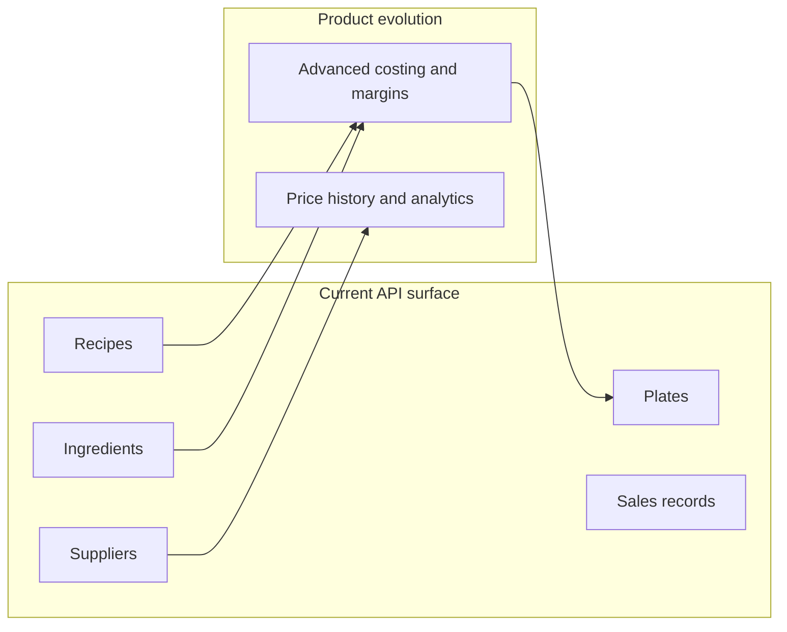

# Tech Cuisine API

Backend for managing professional kitchen operations — from recipe catalog to cost control and pricing, with a focus on fine dining.

---

## What is implemented

FastAPI application with Beanie ODM backed by MongoDB. User registration with Argon2 password hashing (HMAC-SHA256 peppered). **JWT access and refresh tokens** for authenticated routes. CRUD-style HTTP APIs for recipes, ingredients, plates (menu items with pricing hints), suppliers, sales records, and per-user **configuration** (profile preferences). User **profile** endpoints (`/users/me`) and **admin-only** user listing and detail. **Liveness** at `GET /health` (process up, no database check) and **readiness** at `GET /health/ready` (MongoDB ping; **503** when the database is unreachable). **Rate limiting** (slowapi): a global default per client IP, with tighter caps on registration and login (see below). Optional **Redis response cache**: GET endpoints for recipes, ingredients, plates, users, and configurations are cached per user with versioned keys; mutations invalidate the relevant namespace automatically.

Full route specs, request bodies, and response models are available in the interactive OpenAPI UI.

### Authentication

- Obtain tokens with `POST /api/v1/auth/login` (OAuth2 password form: `username` + `password`).
- Send `Authorization: Bearer <access_token>` on protected routes.
- Refresh the access token with `POST /api/v1/auth/refresh`, passing the **refresh** token in `Authorization: Bearer <refresh_token>` (see route description in `/docs`).
- Inactive accounts receive `403` on login; invalid credentials return `401`.
- When rate limiting is enabled, `POST /register_user` and `POST /login` use the **`RATE_LIMIT_AUTH`** limit string (default **10/minute** per IP); other routes use the global default unless exempted. `POST /refresh` follows the global default.

### Rate limiting

The app uses **slowapi** ([`app/core/rate_limit.py`](app/core/rate_limit.py)): limits are keyed by **client IP** (`get_remote_address`). Set `RATE_LIMIT_ENABLED=false` to disable the middleware and all limits (useful in local or automated tests). When enabled, exceeding a limit returns **HTTP 429**.

- **Global default:** `RATE_LIMIT_DEFAULT` (default `100/minute`) applies to routes without a route-specific limit.
- **Auth routes:** `POST /register_user` and `POST /login` use **`RATE_LIMIT_AUTH`** (default `10/minute`) per IP.
- **Storage:** if `RATE_LIMIT_STORAGE_URI` is unset, the limiter uses in-memory storage (`memory://`). For multiple workers or persistence across restarts in production, set `RATE_LIMIT_STORAGE_URI` to a URI supported by the underlying limiter (for example Redis-style backends, per slowapi / limits library documentation).
- **Exempt routes:** `GET /health` and `GET /health/ready` are decorated with `@limiter.exempt` and never count toward any limit (safe for liveness and readiness probes).

### Response caching (Redis)

GET responses for the following routes are cached in Redis, keyed by **user ID** and a versioned namespace. Mutations (create / update / delete) bump the namespace version, which invalidates all stale keys for that user and resource.

| Route | Cache namespace |
|---|---|
| `GET /api/v1/recipes` (list), `GET /api/v1/recipes/by-name`, `GET /api/v1/recipes/{recipe_id}` | `recipes` |
| `GET /api/v1/ingredients` (list), `GET /api/v1/ingredients/by-name`, `GET /api/v1/ingredients/{ingredient_id}` | `ingredients` |
| `GET /api/v1/plates` (list), `GET /api/v1/plates/by-name`, `GET /api/v1/plates/{plate_id}` | `plates` |
| `GET /api/v1/users/me` | `user_me` |
| `GET /api/v1/configurations/me` | `configuration` |

`GET /{recipe_id}/scale` is **not cached** (computed on every request).  
`PATCH /configurations/me` also invalidates `user_me` because profile mutations affect the user representation.

Enable with `REDIS_CACHE_ENABLED=true` and `REDIS_URL` (see environment variables). If Redis is unreachable at startup, the API continues without cache.

### Endpoints (overview)

All versioned routes live under `/api/v1` by default (`API_V1_STR`). Interactive docs: **`/docs`** (Swagger UI) and **`/redoc`**.

| Area | Base path | Summary |
|---|---|---|
| **Health** | `/health`, `/health/ready` | Liveness: `GET /health`. Readiness: `GET /health/ready` pings MongoDB; **503** if not ready. |
| **Auth** | `/api/v1/auth` | `POST /` (`AuthStatusSchema`; `authenticated` defaults to `false`), `POST /register_user`, `POST /login` (**10/min per IP** when rate limiting is on), `POST /refresh` (global default) |
| **Users** | `/api/v1/users` | `GET/PATCH /me` (authenticated); `GET /`, `GET /{user_id}` (**admin**); cursor pagination on list |
| **Configurations** | `/api/v1/configurations` | `POST /`, `GET/PATCH/DELETE /me` (authenticated user’s profile config); `DELETE /me` soft-deletes the account |
| **Recipes** | `/api/v1/recipes` | CRUD; list with cursor; `GET /by-name`; `GET /{recipe_id}/scale` |
| **Ingredients** | `/api/v1/ingredients` | CRUD; list with cursor; `GET /by-name` |
| **Plates** | `/api/v1/plates` | CRUD; list with cursor; `GET /by-name` |
| **Suppliers** | `/api/v1/suppliers` | Full CRUD; list with cursor |
| **Sales records** | `/api/v1/sales-records` | Create, list (cursor), get by id |

---

## Product scope

Some areas already have HTTP APIs (recipes, ingredients, suppliers, sales, plates with pricing fields). The table below describes the broader product vision; not every analytical feature is fully modeled in the API yet.

| Module | Description |
|---|---|
| **Recipes** | Registration and management of recipes with technical sheets |
| **Ingredients** | Inventory of inputs with yield and unit control |
| **Costs (food cost)** | Cost per recipe, margin, and break-even analysis |
| **Pricing** | Selling price policy per menu item |
| **Suppliers** | Registration, price history, and supplier comparison |
| **Sales** | Recording sales of prepared products |

---

## Environment variables

| Variable | Required | Description |
|---|---|---|
| `mongodb_uri` | Yes | MongoDB connection string (often set via `MONGODB_URI` in `.env`; pydantic-settings accepts env aliases). |
| `mongodb_db_name` | No | Database name (default: `tech_cuisine_db`). |
| `JWT_SECRET_KEY` | Yes | Secret used to sign JWT access and refresh tokens. Generate with: `python -c "import secrets; print(secrets.token_hex(32))"`. |
| `PASSWORD_PEPPER` | Yes | Server-side pepper for password hashing (HMAC-SHA256 before Argon2). Use a long random value; **do not** reuse the JWT secret in production. |
| `SECRET_KEY` | No (legacy) | If set without `JWT_SECRET_KEY` / `PASSWORD_PEPPER`, it is copied into both (deprecated; emits warnings). Prefer explicit `JWT_SECRET_KEY` and `PASSWORD_PEPPER`. |
| `JWT_ALGORITHM` | No | Default `HS256`. |
| `ACCESS_TOKEN_EXPIRE_MINUTES` | No | Access token lifetime (default: 30). |
| `ACCESS_TOKEN_REFRESH_DAYS` | No | Refresh token lifetime (default: 7). |
| `APP_ENV` | No | e.g. `development` / `production` (affects CORS validation). |
| `CORS_ALLOWED_ORIGINS` | Conditional | List of allowed origins. Required when `CORS_ALLOW_CREDENTIALS` is true, and required in production when `APP_ENV=production`. |
| `CORS_ALLOW_CREDENTIALS` | No | Default `false`. If `true`, `CORS_ALLOWED_ORIGINS` must be explicitly set. |
| `RATE_LIMIT_ENABLED` | No | Default `true`. When `false`, rate-limit middleware and limits are not applied. |
| `RATE_LIMIT_DEFAULT` | No | Global limit string (default: `100/minute`) for routes without a per-route decorator. |
| `RATE_LIMIT_AUTH` | No | Limit string for `POST /register_user` and `POST /login` (default: `10/minute`). |
| `RATE_LIMIT_STORAGE_URI` | No | Redis URI for slowapi counters (DB 0 recommended, e.g. `redis://redis:6379/0`). Omit for in-memory storage. |
| `REDIS_URL` | No | Redis URI used by the application cache (DB 1 recommended, e.g. `redis://redis:6379/1`). Required when `REDIS_CACHE_ENABLED=true`. |
| `REDIS_CACHE_ENABLED` | No | Default `false`. Set to `true` to enable response caching via Redis. If Redis is unreachable at startup, the API continues without cache. |
| `REDIS_CACHE_TTL_SECONDS` | No | Cache TTL in seconds (default: `120`). Applies to all cached responses. |

> **Warning:** Changing `PASSWORD_PEPPER` after users have registered invalidates existing password hashes. Treat it as a long-lived secret; rotation implies a password reset story. Changing `JWT_SECRET_KEY` invalidates all outstanding tokens.

---

## How to run

**Prerequisites:** Python 3.11+, Docker

**Install dependencies:**
```bash
pip install -r requirements.txt -r requirements-dev.txt
```

Ensure `.env` includes at least `mongodb_uri`, `JWT_SECRET_KEY`, and `PASSWORD_PEPPER` (see table above).

**Start MongoDB, Redis, and the API:**
```bash
docker compose up -d
uvicorn app.main:app --reload
```

To enable Redis caching and rate-limit storage, add the following to `.env`:
```
RATE_LIMIT_STORAGE_URI=redis://localhost:6380/0
REDIS_URL=redis://localhost:6380/1
REDIS_CACHE_ENABLED=true
REDIS_CACHE_TTL_SECONDS=120
```

> **Note on ports and DB separation:** The Docker Compose `redis` service maps container port 6379 to **host port 6380** (`6380:6379`). When running `uvicorn` on the host (outside Docker), use `localhost:6380`. When `api` runs inside the Compose network, use the service name and the internal port: `redis://redis:6379/0` and `redis://redis:6379/1`. Use DB 0 for `RATE_LIMIT_STORAGE_URI` (slowapi counters) and DB 1 for `REDIS_URL` (application cache) to avoid key collisions.

---

## Tests

**Stack:** `pytest` + `pytest-asyncio` (async mode) + `httpx.AsyncClient` + `pytest-cov`

The suite runs against a real MongoDB instance — no mocking of the database layer.

### Running locally

Start the MongoDB container first:
```bash
docker compose up -d mongodb
```

Then run with coverage:
```bash
# Option A — load .env so MONGODB_URI is available (conftest rewrites the hostname automatically)
export $(grep -v '^#' .env | xargs) && pytest --cov=app --cov-report=term-missing --cov-fail-under=90

# Option B — pass the URI explicitly
mongodb_uri="mongodb://admin:<password>@localhost:27017/?authSource=admin" pytest --cov=app --cov-report=term-missing --cov-fail-under=90
```

### MongoDB URI resolution

`tests/conftest.py` resolves the URI in priority order so no manual configuration is needed in CI:

| Priority | Source | Notes |
|---|---|---|
| 1 | `mongodb_uri` (lowercase env var) | Used as-is. Set by CI. |
| 2 | `MONGODB_URI` (uppercase env var) | Docker Compose service hostname `mongodb` is rewritten to `localhost` automatically. |
| 3 | `mongodb://localhost:27017` | Fallback for a local MongoDB without authentication. |

The test harness sets `JWT_SECRET_KEY` and `PASSWORD_PEPPER` to safe defaults when unset (CI/local). It also sets `RATE_LIMIT_ENABLED=false` and `REDIS_CACHE_ENABLED=false` so tests run without Redis and are not affected by rate-limit counters.

### Tests by area

| Tests | Focus |
|---|---|
| `tests/test_passwords.py` | Password hashing (`hash_password`, `verify_password`, pepper handling) |
| `tests/test_auth.py` | Registration, login, refresh, auth home |
| `tests/test_login_schema.py` | Token and login-related schemas |
| `tests/test_health.py` | `GET /health` |
| `tests/test_dependencies.py` | App dependencies / settings |
| `tests/test_main.py` | Application lifespan |
| `tests/test_models.py` | Document models and mixins |
| `tests/test_recipes.py`, `tests/test_recipes_crud.py`, `tests/test_recipes_scale.py`, `tests/test_recipes_auth.py` | Recipe routes and scaling |
| `tests/test_ingredients_crud.py`, `tests/test_ingredients_auth.py` | Ingredient routes |
| `tests/test_plates_crud.py` | Plate routes |
| `tests/test_suppliers_crud.py` | Supplier routes |
| `tests/test_sales_records_crud.py` | Sales record routes |
| `tests/test_configurations_crud.py` | Configuration and account close |
| `tests/test_users_crud.py` | User profile and admin user APIs |
| `tests/test_rate_limit.py` | slowapi behavior (429 after threshold; exempt route in an isolated app fixture) |

### Coverage

GitHub Actions requires **at least 90%** line coverage on `app/`. Run `pytest --cov=app --cov-report=term-missing` locally for the current total; recent runs report **about 96%** line coverage (exact figure changes as the codebase grows).

### CI

GitHub Actions (`.github/workflows/ci.yml`) runs on every push and pull request to `main`:

- Spins up a `mongo:7` service container (no authentication required in CI).
- Installs `requirements.txt` + `requirements-dev.txt`.
- Runs `pytest --cov=app --cov-report=term-missing --cov-report=xml --cov-fail-under=90`.
- **The job fails if coverage drops below 90%**, blocking the merge.

To enforce this gate: Settings → Rulesets → require the `tests` status check on `main`.

---

## Project structure

```
tech-cuisine-api/
├── app/
│   ├── main.py                        # FastAPI app, CORS, lifespan, rate limit middleware (if enabled), routers
│   ├── api/
│   │   ├── health.py                  # Liveness + readiness: /health, /health/ready
│   │   ├── dependencies.py          # Auth, services, settings
│   │   └── v1/
│   │       ├── router.py             # Aggregates v1 API routers
│   │       └── endpoints/
│   │           ├── auth_router.py
│   │           ├── user_router.py
│   │           ├── configuration_router.py
│   │           ├── recipes_router.py
│   │           ├── ingredient_router.py
│   │           ├── plate_router.py
│   │           ├── supplier_router.py
│   │           └── sales_record_router.py
│   ├── core/
│   │   ├── config.py                 # Settings (pydantic-settings, lru_cache)
│   │   ├── database.py             # init_db / close_db (Motor + Beanie)
│   │   ├── rate_limit.py           # slowapi Limiter (defaults + storage from settings)
│   │   ├── redis_client.py         # async Redis pool (connect / get / close)
│   │   ├── cache.py                # CacheService: versioned get/set/bump
│   │   └── exceptions.py
│   ├── models/                     # Beanie documents (see models/__init__.py)
│   ├── schemas/                    # Pydantic schemas per domain
│   ├── repositories/               # Data access
│   ├── services/                   # Business logic
│   └── security/
│       ├── passwords.py            # Argon2 + HMAC-SHA256 pepper
│       └── jwt_tokens.py           # JWT create/decode
├── tests/
│   ├── conftest.py                 # async_client, MongoDB URI, test env
│   └── test_*.py                  # See “Tests by area”
├── .github/workflows/ci.yml
├── requirements.txt
├── requirements-dev.txt
├── pytest.ini
├── docker-compose.yml
└── Dockerfile
```

---

## Roadmap



---

## License

Licensed under [CC BY-NC-SA 4.0 with additional terms](license).

Non-commercial use. Production use, modification and distribution require prior written permission — see the `license` file for full details.

Licensor: Daniel Fonseca da Silva

Contact: dafondeveloper@gmail.com

Website: https://www.daniel-fonseca.online

Company: https://www.dafon.online
